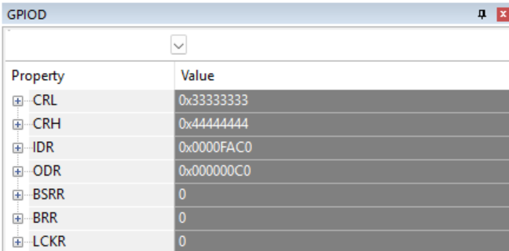

# 实验报告：按键扫描与数码管显示（STM32F10x）

<style>
/* PDF/打印友好设置：代码块自动换行、适度缩小字体，图片自适应宽度 */
pre, code {
  white-space: pre-wrap !important;
  word-break: break-word !important;
  /* 允许跨页打印：不要把整个代码块强制留在同一页 */
  page-break-inside: auto !important;
  -webkit-region-break-inside: auto !important;
  break-inside: auto !important;
}
pre { 
  padding: 8px !important;
  overflow: visible !important; /* 允许跨页延续，避免被裁剪 */
}
img { max-width: 100% !important; height: auto !important; }
@media print {
  pre, code { font-size: 0.85em !important; }
}
</style>

### **实验目的**
- **理解**：掌握寄存器方式编程与标准库函数（StdPeriph）方式编程的区别。 
- **实现**：完成按键矩阵扫描与多位数码管动态显示（轮询/中断+定时器两种思路）。
- **验证**：在 Keil 调试下查看 `CRL/CRH` 寄存器及在 Watch 窗口观察变量以验证程序行为。


### **一、寄存器方式编程 与 库函数方式编程 的比较**
- **寄存器方式（Register-level）**: 优点是最直接、体积小、对时序/寄存器位精确控制，缺点是可读性差、易错、移植性差。
  - 代码示例（摘自 `user\GPIO.c`）:

```c
// 使能 PORTE 时钟 & 设置 PE8 为推挽输出
RCC_APB2ENR |= 1<<6;
GPIOE_CRH &= 0XFFFFFFF0;
GPIOE_CRH |= 0x3;
GPIOE_BSRR = 1<<8; // PE8 输出高

// 键盘引脚配置（PE0..PE3 为输入上拉，PE4..PE7 为推挽输出）
GPIOE_CRL = 0x33338888;
```

- **库函数方式（StdPeriph）**: 优点为可读性好、易维护、利于移植；缺点为代码体积略大，抽象隐藏了一些细节。
  - 等价库函数写法示例：

```c
RCC_APB2PeriphClockCmd(RCC_APB2Periph_GPIOE, ENABLE);
GPIO_InitTypeDef GPIO_InitStructure;
// 行（PE4..PE7）作为推挽输出
GPIO_InitStructure.GPIO_Pin = GPIO_Pin_4|GPIO_Pin_5|GPIO_Pin_6|GPIO_Pin_7;
GPIO_InitStructure.GPIO_Mode = GPIO_Mode_Out_PP;
GPIO_InitStructure.GPIO_Speed = GPIO_Speed_50MHz;
GPIO_Init(GPIOE, &GPIO_InitStructure);
// 列（PE0..PE3）作为上拉输入
GPIO_InitStructure.GPIO_Pin = GPIO_Pin_0|GPIO_Pin_1|GPIO_Pin_2|GPIO_Pin_3;
GPIO_InitStructure.GPIO_Mode = GPIO_Mode_IPU;
GPIO_Init(GPIOE, &GPIO_InitStructure);
```


### **二、引入中断后对按键扫描与数码管显示的改变**
#### 2.1 按键处理
  - 按键矩阵的“列”（`PE0`~`PE3`）配置为上拉输入并映射到 EXTI，ISR 仅记录发生下降沿的列并置标志位，实际的行列扫描与去抖在主处理函数中完成（见 `user/NEG.c`）。这种做法把硬件事件捕获交给中断，耗时操作放到主循环，避免在中断中阻塞。下面是关键片段：

```c
// 初始化：把 PE0..PE3 映射为 EXTI，并使能 EXTI0..3 中断
GPIO_EXTILineConfig(GPIO_PortSourceGPIOE, GPIO_PinSource0);
// ... 同理配置 PinSource1..3
EXTI_InitTypeDef exti;
exti.EXTI_Mode = EXTI_Mode_Interrupt;
exti.EXTI_Trigger = EXTI_Trigger_Falling;
exti.EXTI_LineCmd = ENABLE;
exti.EXTI_Line = EXTI_Line0; EXTI_Init(&exti);
// ... EXTI_Line1..3

// ISR: 仅记录触发的列并置扫描标志
void EXTI0_IRQHandler(void)
{
    if (EXTI_GetITStatus(EXTI_Line0) != RESET) {
        EXTI_ClearITPendingBit(EXTI_Line0);
        g_pending_cols_mask |= (1u << 0);
        g_need_scan = 1;
    }
}
```

  - 主处理函数 `read_Key()` 在检测到 `g_need_scan` 时只对触发的列做定向扫描（`keyborad_scan_column()`），并执行简单去抖与连发逻辑。核心思路为“中断触发 -> 主循环定向扫描确认 -> 报告键值”。代码片段：

```c
if (g_need_scan) {
    for (uint8_t c = 0; c < 4; ++c) {
        if (g_pending_cols_mask & (1u << c)) {
            int code = keyborad_scan_column(c);
            if (code >= 0) { cur = code; break; }
        }
    }
    g_need_scan = 0;
    g_pending_cols_mask = 0;
}
```

#### 2.2 数码管刷新
  - 用 `TIM4` 周期中断做逐位刷新，显示缓冲 `g_digits[]` 存放要显示的值，`TIM4_IRQHandler` 先熄灭当前位/段，再切换位索引并输出下一个位的段码与位选，从而避免在显示函数中用 `Delay()` 阻塞。核心片段：

```c
void TIM4_IRQHandler(void)
{
    if (TIM_GetITStatus(TIM4, TIM_IT_Update) != RESET) {
        TIM_ClearITPendingBit(TIM4, TIM_IT_Update);
        // 熄灭当前位与段
        // 切换到下一个位
        g_cur_digit = (g_cur_digit + 1) & 0x03;
        // 输出段码并选通对应位
        int val = g_digits[g_cur_digit];
        GPIO_ResetBits(GPIOD, SEG_MASK[val]);
        GPIO_ResetBits(GPIOC, (1<< (10 + g_cur_digit))); // 选通位，低有效
    }
}
```


### **三、Keil 调试：查看 CRL/CRH 并解释数值**

<div style="display:flex;gap:24px;align-items:flex-start;justify-content:center;">
  <div style="text-align:center;display:inline-block;">
    <b>GPIOD 寄存器</b><br>
    <br>
    <code>CRL = 0x33333333 &nbsp;&nbsp; CRH = 0x44444444</code><br>
  </div>
  <div style="text-align:center;display:inline-block;">
    <b>GPIOC 寄存器</b><br>
    <br>
    <code>CRL = 0x44444444 &nbsp;&nbsp; CRH = 0x44333344</code><br>
  </div>
</div>

下面对这两张截图中的寄存器值进行说明（针对你提供的实际截图）：

- **GPIOD（左图）解析**
  - `CRL = 0x33333333`：表示 Pin0..Pin7 的每个 nibble 都是 `0x3`（0011b），即 MODE=11 CNF=00 -> 通用推挽输出，50MHz。说明 PD0..PD7 配为推挽输出（驱动段或其他）。
  - `CRH = 0x44444444`：表示 Pin8..Pin15 的每个 nibble 都是 `0x4`（0100b），即 MODE=00 CNF=01 -> 输入浮空（输入浮空/高阻）。说明 PD8..PD15 配为浮空输入。

- **GPIOC（右图）解析**
  - `CRL = 0x44444444`：Pin0..Pin7 全为 `0x4` -> 输入浮空（MODE=00 CNF=01）。这些低位引脚当前配置为浮空输入。
  - `CRH = 0x44333344`：拆为 Pin8..Pin15 的 nibble（从 Pin8 到 Pin15 依次为 `0x4,0x4,0x3,0x3,0x3,0x3,0x4,0x4`）：
      - Pin10..Pin13 的 nibble = `0x3` -> MODE=11 CNF=00 -> 通用推挽输出（PD10..PD13 为输出）。
      - 其余 nibble = `0x4` -> 输入浮空。


组合读取这些寄存器可以验证：
  1) 配置正确：CRL/CRH 的 nibble 能直接反映每个引脚的 MODE/CNF 配置（输出/输入、推挽/浮空等），与代码中的初始化相符；
  2) 运行时状态一致：ODR 显示软件设置的输出位，IDR 反映输入 & 输出回读的实际电平，通过对比可确认按键矩阵或段位驱动是否按预期工作。

### **四、在 Watch 窗口添加变量并验证按键值**
<div align="center">
    
</div>

在按下几个按键后，寄存器`a`的值变为按下几个按键的值，说明程序设计正确
### **五、实验心得**
- 使用寄存器方式可以快速定位硬件接线问题，并直接看到寄存器位的效果；不过库函数实现的可读性更好，适合复杂项目。
- 中断 + 定时器模式是按键响应和数码管刷新的推荐组合：按键中断触发事件，定时器负责稳定的显示刷新，主循环处理高层逻辑（协议、通信等）。
- 在调试时，合理使用 Keil 的 `Peripherals`（CRL/CRH/IDR/ODR）和 `Watch` 可以快速验证 IO 配置与运行时行为。

