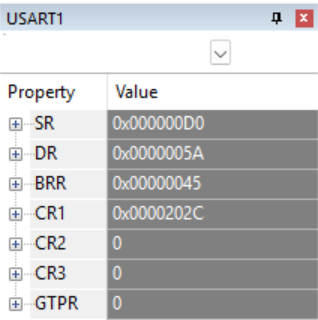
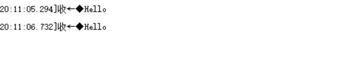
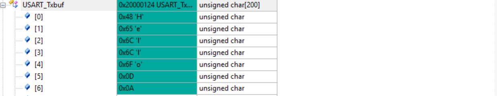
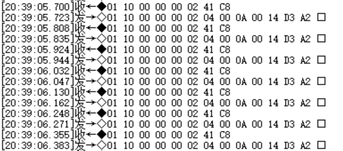

# USART串口通信实验报告

<style>
/* PDF/打印友好设置：代码块自动换行、适度缩小字体，图片自适应宽度 */
pre, code {
  white-space: pre-wrap !important;
  word-break: break-word !important;
  /* 允许跨页打印：不要把整个代码块强制留在同一页 */
  page-break-inside: auto !important;
  -webkit-region-break-inside: auto !important;
  break-inside: auto !important;
}
pre { 
  padding: 8px !important;
  overflow: visible !important; /* 允许跨页延续，避免被裁剪 */
}
img { max-width: 100% !important; height: auto !important; }
@media print {
  pre, code { font-size: 0.85em !important; }
}
</style>

### 一、验证串口接收情况

<div align="center">

</div>

这里通过sscom软件发送数据`5A`,观察可以发现`USART1`的`DR`寄存器的值变为`5A`，说明串口收发正常。

### 二、验证串口发送情况
```c
void RS232_test()
{
    while ((USART1->CR1 & USART_CR1_TXEIE) == USART_CR1_TXEIE);

    char msg[] = "Hello\r\n";
    SendBufLen = 7;
    memcpy(USART_Txbuf, msg, SendBufLen);

    SendPos = 0;
    USART_SendData(USART1, USART_Txbuf[SendPos++]);
}
```

这里控制stm32在初始化的时候向PC端发送字符串`Hello\r\n`，通过串口助手可以看到成功接收到该字符串，说明串口发送功能正常。这里寄存器`USART_Txbuf`中存储了要发送的数据,可以看到`Hello\r\n`的ASCII码依次存储在`USART_Txbuf`中。

<div align="center">


</div>

### 三、Modbus功能验证
这里通过发送Modbus功能码`0x03`和`0x10`来验证Modbus功能是否正常。
```c
void Modbus_InitRegs(void)
{
for(u16 i=0;i<HOLD_REG_NUM;i++) HoldReg[i] = i;
}
```
这里为了方便观察，先初始化了寄存器`HoldReg`，使其值等于寄存器地址。
#### 1. 功能码`0x03`（读保持寄存器）
发送请求帧`01 03 00 00 00 02 C4 0B`，表示读取从机地址为`01`的保持寄存器，从地址`0000`开始读取`2`个寄存器。成功接收到响应帧`01 03 04 00 00 00 01 3B F3`

#### 2. 功能码`0x10`（写多个寄存器）
发送请求帧`01 10 00 00 00 02 04 00 0A 00 14 85 C9`，表示向从机地址为`01`的保持寄存器，从地址`0000`开始写入`2`个寄存器，数据分别为`000A`和`0014`。成功接收到响应帧`01 10 00 00 00 02 41 C8 `，表示写入成功。

#### 3.定时发送
通过串口助手以100ms间隔连续发送多字节数据，响应正常：
